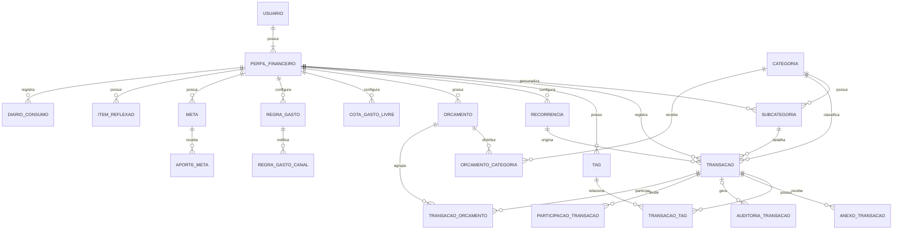

# Orca Finance — Modelo de Dados

> **Status:** modelo conceitual + lógico consolidado — versão final para o escopo atualmente definido  
> **Objetivo:** servir como fonte oficial para o DER, modelo físico PostgreSQL, `schema.prisma`, migrations e implementação do backend.  
> **Escopo:** consolida requisitos, backlog, regras de negócio, fluxo de telas, Design System, auditorias realizadas e decisões arquiteturais já tomadas. Funcionalidades cuja regra de negócio continua pendente permanecem explicitamente fora do fechamento físico.
>
> **Versão consolidada:** esta versão substitui os modelos intermediários usados durante a auditoria. Mantém `Transacao.anotacao`; exclusão física de `Transacao`; `AuditoriaTransacao.transacaoId` nullable com `ON DELETE SET NULL`; cascatas dos filhos descartáveis; `Subcategoria.ativa`; idempotência simples de recorrência; `RegraAutomacao` validada no Service; `Orcamento.nome` opcional; RF67 como estado local; e `PausaFinanceira` como decisão pendente.

---

## 1. Fontes e decisões consideradas

Este modelo considera como fontes principais do projeto:

1. requisitos funcionais do Orca Finance;
2. backlog revisado e rastreabilidade RF → US;
3. regras de negócio revisadas e consolidadas;
4. fluxo de telas da Sprint 1;
5. Design System atualizado;
6. arquitetura do front-end;
7. decisões arquiteturais tomadas durante a definição do backend.

### 1.1 Stack de backend já definida

A implementação futura do modelo será realizada sobre:

- **Node.js**;
- **TypeScript**;
- **NestJS**;
- **Fastify Adapter** como servidor HTTP do Nest;
- **REST/JSON** como estilo inicial da API;
- **Prisma ORM**;
- **PostgreSQL**.

A escolha da stack não altera o modelo conceitual. O Prisma representa apenas a futura implementação do modelo lógico/físico.

### 1.2 Decisões estruturais já consolidadas

- Uma conta `Usuario` possui **um ou vários** `PerfilFinanceiro`.
- Cada `PerfilFinanceiro` pertence a **exatamente um** `Usuario`.
- O perfil é a unidade de isolamento dos dados financeiros.
- O primeiro perfil é criado automaticamente no cadastro da conta.
- Todo perfil novo inicia sem movimentações financeiras e, consequentemente, com saldo `0`.
- A moeda-base inicial do perfil é `BRL`.
- Categorias principais formam um **catálogo global predefinido**.
- O usuário não cria categorias principais.
- Subcategorias são personalizadas e pertencem ao perfil financeiro.
- `descricao` é a identificação nominal obrigatória da transação, por exemplo: `Supermercado Extra`, `Salário`, `Uber`.
- A transação pode possuir `anotacao` opcional, distinta de `descricao`, para contexto adicional conforme RF36/US02.
- Metas constituem um módulo separado das receitas/despesas comuns.
- Aportes de meta não alteram automaticamente o saldo financeiro.
- O bloqueio local por PIN/biometria é diferente da autenticação remota da conta.
- PIN e dados biométricos não fazem parte do banco central do backend.
- Dashboard, relatórios, saldo, métricas, planejado x realizado e outras visões consolidadas são prioritariamente **dados derivados**, e não entidades persistidas próprias.

---

# 2. Princípios gerais do modelo

## 2.1 Perfil financeiro como raiz do domínio financeiro

A propriedade dos dados seguirá, em regra:

```text
Usuario
   |
   | 1:N
   v
PerfilFinanceiro
   |
   +--> Transacoes
   +--> Subcategorias
   +--> Orcamentos
   +--> Metas
   +--> Recorrencias
   +--> Regras de gasto
   +--> Tags
   +--> Demais dados financeiros do perfil
```

Assim, duas áreas financeiras de uma mesma conta — por exemplo, `Pessoal` e `Conjunto` — não compartilham movimentações, orçamento ou metas automaticamente.

## 2.2 IDs

Padrão recomendado:

```text
UUID
```

Motivos:

- evita dependência de IDs sequenciais entre dispositivos;
- funciona bem com sincronização futura;
- facilita geração distribuída;
- possui suporte direto no PostgreSQL e Prisma.

## 2.3 Campos técnicos comuns

Entidades mutáveis persistentes devem possuir, quando aplicável:

```text
id          UUID
createdAt   DateTime
updatedAt   DateTime
```

`updatedAt` também será útil para a futura estratégia de sincronização `last-write-wins`.

Não será criado um campo genérico `deletedAt` em todas as tabelas. Exclusão lógica somente será utilizada quando uma regra concreta exigir.

## 2.4 Valores monetários

Nunca utilizar `float` ou `double` para valores financeiros.

Modelo lógico:

```text
Decimal
```

Modelo físico recomendado no PostgreSQL:

```text
NUMERIC(19, 2)
```

Taxas de câmbio podem exigir precisão maior, por exemplo:

```text
NUMERIC(19, 8)
```

## 2.5 Moedas

Quando uma entidade precisar identificar moeda, utilizar código ISO 4217:

```text
BRL
USD
EUR
...
```

Representação física recomendada:

```text
CHAR(3)
```

## 2.6 Datas e horários

- eventos com horário: `DateTime`;
- datas puras, como uma data-limite: `Date`;
- timestamps técnicos devem ser persistidos em UTC;
- conversão para horário local é responsabilidade da aplicação.

## 2.7 Campos derivados não devem ser duplicados

Sempre que um valor puder ser obtido com segurança a partir da fonte de verdade, ele não deve ser persistido sem uma necessidade concreta.

Exemplos:

```text
saldoAtual
gastosDoMes
percentualMeta
valorAcumuladoMeta
valorRealizadoOrcamento
taxaPoupanca
saldoMedioDiario
```

serão calculados.

---

# 3. Visão geral das entidades

## 3.1 Núcleo confirmado

| Entidade | Tipo | Status |
|---|---|---|
| `Usuario` | domínio | Confirmada |
| `PerfilFinanceiro` | domínio | Confirmada |
| `Categoria` | catálogo global | Confirmada |
| `Subcategoria` | domínio do perfil | Confirmada |
| `Transacao` | domínio | Confirmada |
| `Tag` | domínio do perfil | Confirmada |
| `TransacaoTag` | associação | Confirmada |
| `AnexoTransacao` | domínio | Confirmada |
| `AuditoriaTransacao` | auditoria | Confirmada |
| `Recorrencia` | domínio | Confirmada |
| `LembreteVencimento` | domínio | Confirmada |
| `ParticipacaoTransacao` | domínio | Confirmada |
| `RegraAutomacao` | domínio | Confirmada |
| `Orcamento` | domínio | Confirmada |
| `OrcamentoCategoria` | domínio | Confirmada |
| `TransacaoOrcamento` | associação | Confirmada |
| `CotaGastoLivre` | domínio | Confirmada pela RF57/RN-ORC-05 |
| `RegraGasto` | domínio | Confirmada |
| `RegraGastoCanal` | associação | Decisão técnica adotada |
| `Meta` | domínio | Confirmada |
| `AporteMeta` | domínio | Confirmada |
| `ItemReflexao` | domínio | Confirmada |
| `DiarioConsumo` | domínio | Confirmada |
| `AplicativoGatilho` | domínio/configuração | Confirmada conceitualmente |
| `DesafioEconomia` | domínio | Confirmada, progresso ainda pendente |
| `Conquista` | catálogo | Confirmada |
| `PerfilConquista` | associação | Confirmada |
| `ConteudoEducacao` | catálogo/conteúdo | Confirmada |
| `LeituraConteudo` | associação | Confirmada |
| `PausaFinanceira` | domínio | Modelagem/ownership pendente; fora do núcleo inicial |
| `PlanoGrandeCompra` | domínio | Confirmada conceitualmente |

## 3.2 Entidades técnicas que podem ser adicionadas na implementação

| Entidade | Motivo | Status |
|---|---|---|
| `SessaoAutenticacao` | refresh token/sessão remota | Decisão técnica futura |
| `DispositivoPush` | tokens de push por aparelho | Necessária quando push real for implementado |
| `LoteImportacao` | auditoria de importações | Opcional |
| `CacheCotacao` | reduzir chamadas à API de câmbio | Opcional |
| `CacheNoticia` | cache de notícias externas | Opcional |

## 3.3 Conceitos que não devem virar tabela por padrão

```text
Dashboard
Relatorio
SaldoAtual
GastosDoMes
TaxaPoupanca
SaldoMedioDiario
PlanejadoXRealizado
PrevisaoSaldo
FluxoCaixa
TendenciaGastos
TaxaRealizacaoMetas
SimulacaoCompra
JurosCompostos
CustoOportunidade
```

São consultas, projeções ou cálculos sobre outras entidades.

---

# 4. Domínio de identidade e perfis

## 4.1 `Usuario`

Representa a identidade remota utilizada no cadastro e login.

### Campos

| Campo | Tipo lógico | Obrigatório | Regra |
|---|---|---:|---|
| `id` | UUID | Sim | PK |
| `nome` | String | Sim | Nome informado no cadastro |
| `email` | String | Sim | Identificador de login |
| `senhaHash` | String | Sim | Nunca armazenar senha em texto puro |
| `createdAt` | DateTime | Sim | Técnico |
| `updatedAt` | DateTime | Sim | Técnico |

### Restrições

```text
email UNIQUE
```

O cadastro deve ser recusado caso o e-mail já esteja associado a outra conta.

### Não pertencem à entidade

- PIN;
- biometria;
- CPF;
- telefone;
- data de nascimento;
- endereço;
- foto de perfil;
- perguntas de segurança.

Não existem requisitos atualmente consolidados para esses dados.

### Relacionamentos

```text
Usuario 1:N PerfilFinanceiro
```

---

## 4.2 `PerfilFinanceiro`

Representa um contexto financeiro isolado dentro de uma conta.

### Campos

| Campo | Tipo lógico | Obrigatório | Regra |
|---|---|---:|---|
| `id` | UUID | Sim | PK |
| `usuarioId` | UUID | Sim | FK → Usuario |
| `nome` | String | Sim | Primeiro perfil inicia com nome derivado do usuário e pode ser renomeado |
| `moedaBase` | String(3) | Sim | Padrão `BRL` |
| `createdAt` | DateTime | Sim | Técnico |
| `updatedAt` | DateTime | Sim | Técnico |

### Decisão sobre saldo inicial

**Não será persistido `saldoInicial`.**

Motivo:

- a regra do projeto estabelece que novos perfis iniciam zerados;
- receitas devem ser registradas para formar o saldo;
- elimina uma segunda origem monetária que precisaria de auditoria;
- simplifica dashboard, relatórios e sincronização.

Fórmula:

```text
saldo atual =
SUM(receitas efetivadas)
-
SUM(despesas efetivadas)
```

Transações futuras/previstas não entram no saldo atual.

### Não persistir

```text
saldoAtual
gastosDoMes
receitasDoMes
```

---

# 5. Domínio de categorias

## 5.1 `Categoria`

Catálogo global predefinido.

### Campos

| Campo | Tipo lógico | Obrigatório | Regra |
|---|---|---:|---|
| `id` | UUID | Sim | PK |
| `nome` | String | Sim | Nome oficial |
| `icone` | String | Não | Identificador visual |
| `cor` | String | Não | Token/hex quando necessário |
| `ordem` | Integer | Não | Ordenação visual |
| `ativa` | Boolean | Sim | Permite retirar categoria sem apagar histórico |

### Propriedade

`Categoria` **não possui `perfilId`**.

É um catálogo compartilhado pelo sistema.

### Exemplos atuais

- Alimentação;
- Transporte;
- Moradia;
- Lazer.

A lista completa pode evoluir por seed/migration.

---

## 5.2 `Subcategoria`

Personalização da categoria dentro de um perfil.

### Campos

| Campo | Tipo lógico | Obrigatório | Regra |
|---|---|---:|---|
| `id` | UUID | Sim | PK |
| `perfilId` | UUID | Sim | FK → PerfilFinanceiro |
| `categoriaId` | UUID | Sim | FK → Categoria |
| `nome` | String | Sim | Nome definido pelo usuário |
| `ativa` | Boolean | Sim | Padrão `true`; permite retirar do uso sem quebrar histórico |
| `createdAt` | DateTime | Sim | Técnico |
| `updatedAt` | DateTime | Sim | Técnico |

### Restrições recomendadas

```text
UNIQUE(perfilId, categoriaId, nome)
```

Evita duplicar a mesma subcategoria na mesma categoria e perfil.

### Exclusão

Subcategorias já utilizadas por transações não devem ser apagadas fisicamente. Quando deixarem de ser utilizadas em novos cadastros:

```text
ativa = false
```

Assim, o histórico financeiro continua preservando a referência original.

### Relacionamentos

```text
Categoria 1:N Subcategoria
PerfilFinanceiro 1:N Subcategoria
```

---

# 6. Domínio de transações

## 6.1 `Transacao`

Representa receita ou despesa financeira do perfil.

### Campos principais

| Campo | Tipo lógico | Obrigatório | Regra |
|---|---|---:|---|
| `id` | UUID | Sim | PK |
| `perfilId` | UUID | Sim | FK → PerfilFinanceiro |
| `tipo` | `TipoTransacao` | Sim | `RECEITA` ou `DESPESA` |
| `valor` | Decimal | Sim | Deve ser positivo |
| `dataHora` | DateTime | Sim | Data e hora do lançamento |
| `descricao` | String | Sim | Identificação nominal da transação |
| `anotacao` | Text | Não | Contexto adicional conforme RF36/US02 |
| `categoriaId` | UUID | Não no banco | FK → Categoria; obrigatoriedade depende do caso de uso |
| `subcategoriaId` | UUID | Não | FK → Subcategoria |
| `metodoPagamento` | `MetodoPagamento` | Não | Complementar, sobretudo para despesas |
| `essencialidade` | `Essencialidade` | Sim | Padrão `NAO_CLASSIFICADA` |
| `ehGastoLivre` | Boolean | Sim | Padrão `false` |
| `status` | `StatusTransacao` | Sim | `EFETIVADA` ou `PREVISTA` |
| `recorrenciaId` | UUID | Não | Origem recorrente quando aplicável |
| `ocorrenciaReferencia` | DateTime | Não | Identifica a ocorrência gerada por uma recorrência |
| `createdAt` | DateTime | Sim | Técnico |
| `updatedAt` | DateTime | Sim | Técnico |

### `descricao` e `anotacao`

Não existe campo separado de `titulo`.

`descricao` é obrigatória e funciona como identificação principal da movimentação.

Exemplos:

```text
Supermercado Extra
Salário
Uber
Netflix
Conta de energia
```

`anotacao` é opcional e serve apenas para contexto adicional, por exemplo:

```text
Compra do mês
Reembolso previsto pela empresa
Despesa da viagem
```

A descrição continua sendo usada para:

- identificação nas listas e detalhes;
- busca textual;
- sugestão inteligente de categoria.

### Categoria

O banco permite:

```text
categoriaId = null
```

A obrigatoriedade será validada no caso de uso:

```text
Cadastro manual normal
→ categoria obrigatória

Despesa marcada como gasto livre
→ categoria pode ficar vazia

Importação
→ categoria pode ficar vazia para classificação posterior
```

Essa regra pertence ao Service/Use Case, pois o mesmo modelo atende fluxos diferentes.

### Subcategoria

Se informada:

```text
subcategoria.categoriaId == transacao.categoriaId
subcategoria.perfilId == transacao.perfilId
```

### `TipoTransacao`

```text
RECEITA
DESPESA
```

### `StatusTransacao`

```text
EFETIVADA
PREVISTA
```

`PREVISTA` não afeta saldo atual.

### `Essencialidade`

```text
ESSENCIAL
NAO_ESSENCIAL
NAO_CLASSIFICADA
```

`NAO_CLASSIFICADA` nunca deve ser tratada automaticamente como `NAO_ESSENCIAL`.

### `MetodoPagamento`

Inicialmente será **enum**, e não entidade.

Motivo:

- os requisitos exigem registrar e filtrar pelo método;
- não há requisito de cadastro de cartões, contas ou métodos personalizados;
- criar outra entidade agora adicionaria complexidade sem necessidade.

Enum inicial:

```text
DINHEIRO
PIX
CARTAO_DEBITO
CARTAO_CREDITO
TRANSFERENCIA
OUTRO
```

### Valores em moeda estrangeira

Campos opcionais adicionais:

| Campo | Tipo | Regra |
|---|---|---|
| `moedaOriginal` | String(3) | ISO 4217 |
| `valorOriginal` | Decimal | Valor informado na moeda externa |
| `taxaCambio` | Decimal alta precisão | Taxa usada no momento da conversão |
| `valorConvertido` | Decimal | Valor consolidado na moeda-base |

Quando a transação estiver na moeda-base:

```text
moedaOriginal = null
valorOriginal = null
taxaCambio = null
valorConvertido = null
valor = valor em moeda-base
```

Quando houver conversão, a taxa utilizada deve ser preservada para que o histórico não mude quando a cotação externa mudar.

### Dados de localização

Campos opcionais para RF41:

| Campo | Tipo | Obrigatório |
|---|---|---:|
| `estabelecimento` | String | Não |
| `latitude` | Decimal | Não |
| `longitude` | Decimal | Não |

A origem/geocodificação do estabelecimento será decisão técnica futura.

### Gasto livre

`ehGastoLivre = true` indica explicitamente que a despesa consome a cota mensal de gastos livres.

Uma despesa livre:

- continua sendo despesa normal;
- reduz o saldo;
- entra nos totais gerais;
- pode permanecer sem categoria;
- consome a cota mensal configurada.

### Ocorrência de recorrência

Quando a transação for criada por uma recorrência:

```text
recorrenciaId != null
ocorrenciaReferencia != null
```

A combinação deve ser única:

```text
UNIQUE(recorrenciaId, ocorrenciaReferencia)
```

Isso impede que a mesma ocorrência seja gerada duas vezes.

Transações manuais mantêm ambos os campos nulos.

### Não persistir na transação

```text
saldoAposTransacao
percentualOrcamento
nomeCategoria
nomeSubcategoria
valorFormatado
```

Esses valores são derivados ou relacionais.

---

## 6.2 `Tag`

Tag personalizada do perfil.

| Campo | Tipo | Obrigatório |
|---|---|---:|
| `id` | UUID | Sim |
| `perfilId` | UUID | Sim |
| `nome` | String | Sim |
| `createdAt` | DateTime | Sim |

Restrição:

```text
UNIQUE(perfilId, nome)
```

---

## 6.3 `TransacaoTag`

Tabela associativa N:N.

| Campo | Tipo |
|---|---|
| `transacaoId` | UUID FK |
| `tagId` | UUID FK |

PK/unique composta:

```text
(transacaoId, tagId)
```

Relacionamento:

```text
Transacao N:N Tag
```

---

## 6.4 `AnexoTransacao`

Permite associar recibos/comprovantes.

| Campo | Tipo | Obrigatório |
|---|---|---:|
| `id` | UUID | Sim |
| `transacaoId` | UUID | Sim |
| `tipo` | Enum/String | Sim |
| `arquivoUrl` | String | Sim |
| `mimeType` | String | Não |
| `createdAt` | DateTime | Sim |

Enum inicial:

```text
RECIBO
OUTRO
```

### OCR

Quando OCR for implementado, poderão ser acrescentados:

```text
ocrStatus
ocrResultado Json
```

O formato interno só deve ser fechado junto da implementação do RF29.

---

## 6.5 `AuditoriaTransacao`

Mantém rastreabilidade de criação, edição e reversão/exclusão.

| Campo | Tipo | Obrigatório |
|---|---|---:|
| `id` | UUID | Sim |
| `transacaoId` | UUID | Não |
| `perfilId` | UUID | Sim |
| `operacao` | `OperacaoAuditoria` | Sim |
| `estadoAnterior` | Json | Não |
| `estadoNovo` | Json | Não |
| `realizadoEm` | DateTime | Sim |

### Relação com `Transacao`

Enquanto a transação existir:

```text
AuditoriaTransacao.transacaoId
→ Transacao.id
```

A relação deve utilizar:

```text
ON DELETE SET NULL
```

Portanto, quando a transação for fisicamente excluída, a auditoria permanece e `transacaoId` passa a `null`.

Isso é necessário porque a auditoria precisa sobreviver à reversão da transação.

### `OperacaoAuditoria`

```text
CRIACAO
EDICAO
EXCLUSAO
```

### Snapshot JSON

A auditoria mantém snapshots JSON apenas dos **campos persistidos da entidade `Transacao`**.

Não é objetivo desta versão guardar dentro do snapshot:

- arquivo do recibo;
- tags;
- participações;
- vínculos de orçamento;
- lembretes.

Esses registros associados podem ser removidos junto com a transação conforme a estratégia de exclusão desta versão.

Na exclusão/reversão:

```text
estadoAnterior = estado da Transacao antes da exclusao
estadoNovo = null
```

A transação deixa os dados financeiros ativos, mas o registro de auditoria permanece acessível.

---

## 6.6 `ParticipacaoTransacao`

Suporta finanças compartilhadas.

| Campo | Tipo | Obrigatório |
|---|---|---:|
| `id` | UUID | Sim |
| `transacaoId` | UUID | Sim |
| `nomeParticipante` | String | Sim |
| `valor` | Decimal | Condicional |
| `percentual` | Decimal | Condicional |
| `createdAt` | DateTime | Sim |

Não será exigido que o participante tenha conta no Orca Finance.

### Validações

Divisão por valor:

```text
SUM(valor) == transacao.valor
```

Divisão percentual:

```text
SUM(percentual) == 100
```

O modo exato de divisão poderá ser fechado na US correspondente sem mudar a estrutura central.

---

# 7. Recorrência e transações futuras

## 7.1 `Recorrencia`

Configuração que origina receitas/despesas futuras.

| Campo | Tipo | Obrigatório |
|---|---|---:|
| `id` | UUID | Sim |
| `perfilId` | UUID | Sim |
| `tipoTransacao` | TipoTransacao | Sim |
| `valor` | Decimal | Sim |
| `descricao` | String | Sim |
| `categoriaId` | UUID | Condicional |
| `subcategoriaId` | UUID | Não |
| `metodoPagamento` | MetodoPagamento | Não |
| `frequencia` | FrequenciaRecorrencia | Sim |
| `proximaOcorrencia` | DateTime | Sim |
| `dataTermino` | Date | Não |
| `ativa` | Boolean | Sim |
| `createdAt` | DateTime | Sim |
| `updatedAt` | DateTime | Sim |

### `FrequenciaRecorrencia`

Modelo inicial:

```text
SEMANAL
MENSAL
ANUAL
```

Caso um requisito futuro exija outros intervalos, o enum pode ser ampliado.

### Geração de ocorrência

A transação criada pela recorrência recebe:

```text
transacao.recorrenciaId
transacao.ocorrenciaReferencia
```

A combinação desses campos é única, impedindo geração duplicada da mesma ocorrência.

### Alteração e cancelamento

Editar ou cancelar uma recorrência afeta somente ocorrências futuras.

Transações já efetivadas permanecem no histórico.

### Moeda estrangeira

O cruzamento entre recorrência e transações em moeda diferente da moeda-base ainda não possui regra específica sobre qual cotação utilizar em cada ocorrência.

Portanto, essa ampliação fica pendente e não adiciona novos campos à `Recorrencia` nesta versão.

---

## 7.2 `LembreteVencimento`

Lembrete associado a uma transação futura ou recorrência.

| Campo | Tipo | Obrigatório |
|---|---|---:|
| `id` | UUID | Sim |
| `perfilId` | UUID | Sim |
| `transacaoId` | UUID | Não |
| `recorrenciaId` | UUID | Não |
| `notificarEm` | DateTime | Sim |
| `ativo` | Boolean | Sim |
| `createdAt` | DateTime | Sim |
| `updatedAt` | DateTime | Sim |

### Decisão técnica

Será armazenado diretamente `notificarEm`, e não uma combinação fixa de `antecedencia + unidade`.

Isso simplifica o disparo e permite qualquer antecedência futura sem alterar o modelo.

Deve existir pelo menos uma origem:

```text
transacaoId != null
OU
recorrenciaId != null
```

---

# 8. Regras de automação

## 8.1 `RegraAutomacao`

Representa regras explícitas criadas pelo usuário.

| Campo | Tipo | Obrigatório |
|---|---|---:|
| `id` | UUID | Sim |
| `perfilId` | UUID | Sim |
| `categoriaId` | UUID | Não |
| `subcategoriaId` | UUID | Não |
| `atributoAlvo` | String/Enum | Sim |
| `valorDestino` | Json/String | Sim |
| `ativa` | Boolean | Sim |
| `createdAt` | DateTime | Sim |
| `updatedAt` | DateTime | Sim |

Exemplo:

```text
Se categoria = Transporte
entao essencialidade = ESSENCIAL
```

### Regra de conflito

Para o mesmo:

```text
perfil
+ escopo (categoria/subcategoria)
+ atributoAlvo
```

pode existir no máximo **uma regra ativa**.

Para manter a implementação simples, essa regra será garantida pelo `Service`:

1. procurar regra ativa com o mesmo escopo e atributo;
2. se existir, substituir/desativar a anterior;
3. salvar a nova configuração.

Não é necessário introduzir índice parcial ou constraint avançada nesta fase acadêmica.

O modelo usa `valorDestino` flexível porque os atributos automatizáveis podem evoluir. A validação continua no domínio/service.

---

# 9. Domínio de orçamento

## 9.1 `Orcamento`

Estrutura comum para orçamento mensal, período flexível, temporário e evento.

| Campo | Tipo | Obrigatório |
|---|---|---:|
| `id` | UUID | Sim |
| `perfilId` | UUID | Sim |
| `nome` | String | Não | Nome opcional do orçamento |
| `tipo` | TipoOrcamento | Sim |
| `dataInicio` | Date | Sim |
| `dataFim` | Date | Sim |
| `ativo` | Boolean | Sim |
| `createdAt` | DateTime | Sim |
| `updatedAt` | DateTime | Sim |

### `TipoOrcamento`

Inicial:

```text
MENSAL
PERIODO
TEMPORARIO
EVENTO
ZERO_BASED
```

`INCLUSAO_DIGITAL` não precisa ser um tipo estrutural diferente: tecnicamente pode ser um orçamento/categoria voltado às categorias de serviços digitais.

`GASTOS_LIVRES` será modelado separadamente por possuir regra própria.

### Não persistir diretamente

```text
valorRealizado
percentualConsumido
statusVisual
```

São calculados a partir das transações.

---

## 9.2 `OrcamentoCategoria`

Valor planejado para uma categoria dentro do orçamento.

| Campo | Tipo | Obrigatório |
|---|---|---:|
| `id` | UUID | Sim |
| `orcamentoId` | UUID | Sim |
| `categoriaId` | UUID | Sim |
| `valorPlanejado` | Decimal | Sim |
| `createdAt` | DateTime | Sim |
| `updatedAt` | DateTime | Sim |

Restrição:

```text
UNIQUE(orcamentoId, categoriaId)
```

### Orçamento mensal por categoria

O realizado é calculado:

```text
SUM(
  despesas efetivadas
  da categoria
  no periodo do orcamento
)
```

### Threshold oficial

Regra consolidada:

```text
< 75%       normal
75% a 100%  proximo do limite
> 100%      excedido
```

O estado visual é derivado e não persistido.

---

## 9.3 `TransacaoOrcamento`

Associação de uma transação a orçamento contextual.

| Campo | Tipo |
|---|---|
| `transacaoId` | UUID FK |
| `orcamentoId` | UUID FK |

Uma transação pode simultaneamente:

- afetar o orçamento-base da categoria;
- estar vinculada a orçamento temporário/evento.

O valor financeiro global não é duplicado.

---

## 9.4 `CotaGastoLivre`

A cota mensal tem semântica própria e ficará separada do orçamento genérico.

Para manter a modelagem simples e fácil de explicar no projeto acadêmico, o mês será representado diretamente por `ano` e `mes`.

| Campo | Tipo | Obrigatório | Regra |
|---|---|---:|---|
| `id` | UUID | Sim | PK |
| `perfilId` | UUID | Sim | FK → PerfilFinanceiro |
| `ano` | Integer | Sim | Ano da cota |
| `mes` | Integer | Sim | Mês de `1` a `12` |
| `valorLimite` | Decimal | Sim | Limite mensal configurado |
| `createdAt` | DateTime | Sim | Técnico |
| `updatedAt` | DateTime | Sim | Técnico |

Exemplo:

```text
ano = 2026
mes = 9
→ setembro/2026
```

Restrição:

```text
UNIQUE(perfilId, ano, mes)
```

Consumo:

```text
SUM(
  transacoes
  onde ehGastoLivre = true
  e status = EFETIVADA
  e tipo = DESPESA
  no mesmo perfil, ano e mes
)
```

Essa decisão evita criar uma categoria artificial chamada `Gastos livres` e mantém o modelo mensal explícito.

---

# 10. Limites e regras de gastos

## 10.1 `RegraGasto`

Representa regras configuráveis de limite.

| Campo | Tipo | Obrigatório |
|---|---|---:|
| `id` | UUID | Sim |
| `perfilId` | UUID | Sim |
| `tipo` | TipoRegraGasto | Sim |
| `categoriaId` | UUID | Não |
| `valorLimite` | Decimal | Condicional |
| `percentualLimite` | Decimal | Condicional |
| `periodo` | PeriodoRegra | Sim |
| `baseCalculo` | BaseCalculo | Não |
| `ativa` | Boolean | Sim |
| `createdAt` | DateTime | Sim |
| `updatedAt` | DateTime | Sim |

### `TipoRegraGasto`

```text
LIMITE_DIARIO
LIMITE_CATEGORIA
PERCENTUAL_RENDA
```

### `PeriodoRegra`

Modelo inicial:

```text
DIARIO
SEMANAL
MENSAL
ANUAL
```

### `BaseCalculo`

Quando a regra usar percentual:

```text
RENDA_EFETIVADA
RENDA_PLANEJADA
```

Só deve ser exigida quando o tipo da regra precisar.

---

## 10.2 `RegraGastoCanal`

Associação dos canais usados para alertar determinada regra.

| Campo | Tipo |
|---|---|
| `regraGastoId` | UUID FK |
| `canal` | CanalNotificacao |

### `CanalNotificacao`

```text
PUSH
EMAIL
```

Decisão técnica:

usar tabela associativa em vez de `pushAtivo`, `emailAtivo`, etc.

Isso permite incluir outro canal no futuro sem alterar a entidade principal.

---

# 11. Domínio de metas

## 11.1 `Meta`

| Campo | Tipo | Obrigatório |
|---|---|---:|
| `id` | UUID | Sim |
| `perfilId` | UUID | Sim |
| `nome` | String | Sim |
| `valorAlvo` | Decimal | Sim |
| `dataLimite` | Date | Sim |
| `frequenciaSugestao` | FrequenciaSugestao | Sim |
| `createdAt` | DateTime | Sim |
| `updatedAt` | DateTime | Sim |

### `FrequenciaSugestao`

```text
DIARIA
SEMANAL
```

### Não persistir

```text
valorAcumulado
valorRestante
percentualProgresso
sugestaoAtual
statusCumprida
```

### Cálculos

```text
valorAcumulado = SUM(aportes)
valorRestante = valorAlvo - valorAcumulado
percentual = valorAcumulado / valorAlvo * 100
```

Sugestão:

```text
(valorAlvo - valorAcumulado)
/
dias ou semanas restantes
```

Uma meta é considerada cumprida quando o acumulado alcança ou supera o alvo até a data-limite.

Se vencer sem atingir o alvo:

- informar não cumprimento;
- informar valor faltante;
- permitir alterar `dataLimite`;
- recalcular sugestão após a prorrogação.

---

## 11.2 `AporteMeta`

| Campo | Tipo | Obrigatório |
|---|---|---:|
| `id` | UUID | Sim |
| `metaId` | UUID | Sim |
| `valor` | Decimal | Sim |
| `dataHora` | DateTime | Sim |
| `createdAt` | DateTime | Sim |

Aporte:

- aumenta o progresso da meta;
- não gera automaticamente uma despesa;
- não altera automaticamente o saldo comum.

---

## 11.3 Compartilhamento de meta

A funcionalidade existe, mas o mecanismo de compartilhamento ainda não define se o destinatário:

- é usuário do app;
- é contato do aparelho;
- recebe link;
- recebe e-mail;
- recebe conteúdo por compartilhamento nativo.

Portanto **não será criada agora uma entidade lógica definitiva `CompartilhamentoMeta`**.

A modelagem será fechada junto da decisão de UX/integração de US11/RF30.

---

# 12. Reflexão e consumo consciente

## 12.1 `ItemReflexao`

Representa um item colocado no período de reflexão antes de ser efetivamente comprado.

| Campo | Tipo | Obrigatório |
|---|---|---:|
| `id` | UUID | Sim |
| `perfilId` | UUID | Sim |
| `descricao` | String | Sim |
| `entradaEm` | DateTime | Sim |
| `duracaoHoras` | Integer | Sim |
| `createdAt` | DateTime | Sim |
| `updatedAt` | DateTime | Sim |

### Decisão técnica

`liberadoEm` será calculado:

```text
entradaEm + duracaoHoras
```

e não duplicado.

O item em reflexão **não é `Transacao`** enquanto a compra não for concluída.

---

## 12.2 `AplicativoGatilho`

Aplicativo configurado para disparar pergunta reflexiva.

| Campo | Tipo | Obrigatório |
|---|---|---:|
| `id` | UUID | Sim |
| `usuarioId` | UUID | Sim |
| `nomeAplicativo` | String | Sim |
| `packageName` | String | Sim |
| `ativo` | Boolean | Sim |
| `createdAt` | DateTime | Sim |
| `updatedAt` | DateTime | Sim |

### Decisão de escopo

Pertencerá ao **Usuario**, não ao PerfilFinanceiro.

Motivo:

- é configuração do dispositivo/comportamento pessoal;
- não representa dado financeiro;
- não faz sentido cadastrar novamente os mesmos apps-gatilho ao alternar perfil.

---

## 12.3 `DiarioConsumo`

| Campo | Tipo | Obrigatório |
|---|---|---:|
| `id` | UUID | Sim |
| `perfilId` | UUID | Sim |
| `texto` | Text | Sim |
| `createdAt` | DateTime | Sim |
| `updatedAt` | DateTime | Sim |

O diário permanece associado ao perfil porque trata do comportamento de consumo daquele contexto financeiro.

---

# 13. Desafios e gamificação

## 13.1 `DesafioEconomia`

| Campo | Tipo | Obrigatório |
|---|---|---:|
| `id` | UUID | Sim |
| `perfilId` | UUID | Sim |
| `nome` | String | Não |
| `valorAlvo` | Decimal | Sim |
| `dataInicio` | Date | Sim |
| `dataFim` | Date | Sim |
| `createdAt` | DateTime | Sim |
| `updatedAt` | DateTime | Sim |

### Pendente

Ainda não existe regra consolidada para determinar **como o progresso do desafio é atualizado**.

Portanto não definir agora:

```text
valorAtual
aporteDesafio
transacaoId
metaId
```

A estrutura será estendida quando DP-DES-01 for resolvida.

---

## 13.2 `Conquista`

Catálogo global de badges.

| Campo | Tipo | Obrigatório |
|---|---|---:|
| `id` | UUID | Sim |
| `codigo` | String | Sim |
| `nome` | String | Sim |
| `descricao` | String | Sim |
| `icone` | String | Não |
| `ativa` | Boolean | Sim |

Restrição:

```text
codigo UNIQUE
```

---

## 13.3 `PerfilConquista`

| Campo | Tipo | Obrigatório |
|---|---|---:|
| `perfilId` | UUID | Sim |
| `conquistaId` | UUID | Sim |
| `conquistadaEm` | DateTime | Sim |

Restrição:

```text
UNIQUE(perfilId, conquistaId)
```

---

## 13.4 Certificado

O certificado de desafio será inicialmente **gerado sob demanda**.

Não será criada tabela específica até existir necessidade de persistir:

- arquivo;
- URL;
- histórico de geração.

---

# 14. Educação financeira

## 14.1 `ConteudoEducacao`

Catálogo global de artigos/dicas.

| Campo | Tipo | Obrigatório |
|---|---|---:|
| `id` | UUID | Sim |
| `titulo` | String | Sim |
| `conteudo` | Text | Sim |
| `tipo` | TipoConteudo | Sim |
| `publicadoEm` | DateTime | Não |
| `ativo` | Boolean | Sim |

`TipoConteudo` inicial:

```text
ARTIGO
DICA
```

---

## 14.2 `LeituraConteudo`

Marca o conteúdo já lido.

| Campo | Tipo | Obrigatório |
|---|---|---:|
| `usuarioId` | UUID | Sim |
| `conteudoId` | UUID | Sim |
| `lidoEm` | DateTime | Sim |

### Decisão de escopo

Pertencerá ao **Usuario**, não ao perfil.

Motivo:

- conteúdo educacional não é dado financeiro;
- trocar de perfil não deve fazer o mesmo artigo aparecer como "não lido".

Restrição:

```text
UNIQUE(usuarioId, conteudoId)
```

---

# 15. Planejamento de grandes compras

## 15.1 `PlanoGrandeCompra`

A funcionalidade exige que o plano permaneça disponível ao usuário, portanto existe entidade persistente.

| Campo | Tipo | Obrigatório |
|---|---|---:|
| `id` | UUID | Sim |
| `perfilId` | UUID | Sim |
| `nome` | String | Sim |
| `valorTotal` | Decimal | Sim |
| `valorMensalPlanejado` | Decimal | Não |
| `dataInicio` | Date | Sim |
| `createdAt` | DateTime | Sim |
| `updatedAt` | DateTime | Sim |

### Valores derivados

Se houver `valorMensalPlanejado`:

```text
quantidadeMeses = CEIL(valorTotal / valorMensalPlanejado)
```

A regra definitiva de quanto "cabe no orçamento" será implementada no service a partir do orçamento do perfil; não precisa ser persistida como coluna.

---

# 16. Modo pausa financeira

RF56/US41 identifica a necessidade de um período em que o aplicativo permita somente visualização.

Entretanto, os documentos atuais não definem se a pausa pertence:

```text
ao Usuario inteiro
OU
ao PerfilFinanceiro ativo
```

### Decisão desta versão

`PausaFinanceira` permanece como **entidade conceitual pendente** e não entra no núcleo inicial do banco nem na primeira migration.

Campos e ownership serão definidos quando US41 entrar em implementação.

Isso evita transformar uma recomendação arquitetural em regra de produto não aprovada.

---

# 17. Check-in financeiro

A funcionalidade exige perguntas e feedback, porém a regra/fonte do feedback personalizado ainda não está consolidada.

Portanto o modelo definitivo fica pendente.

Entidades conceituais previstas:

```text
CheckinFinanceiro
RespostaCheckin
```

Modelo mínimo possível no futuro:

```text
CheckinFinanceiro
- id
- perfilId
- realizadoEm

RespostaCheckin
- id
- checkinId
- perguntaCodigo
- resposta
```

Não implementar até DP-CHK-01 definir perguntas e mecanismo de feedback.

---

# 18. Personalização visual e modo de apresentação

Existem requisitos de:

- modo escuro;
- cores do tema;
- cores de gráficos;
- modo de apresentação/privacidade do RF67.

### Modo de apresentação — RF67

O modo que oculta valores monetários e exibe apenas percentuais será tratado nesta versão como **estado local do aplicativo**.

Portanto:

```text
RF67
→ não gera tabela no backend
→ não gera campo em Usuario ou PerfilFinanceiro
```

Se futuramente houver requisito para sincronizar essa preferência entre dispositivos, a decisão poderá ser revista.

### Demais preferências visuais

A separação exata entre preferências globais da conta e preferências específicas do perfil ainda não é necessária para o núcleo financeiro.

Por isso, não será criada agora uma tabela rígida de preferências visuais.

---

# 19. Notificações e dispositivos

## 19.1 Preferências

Alertas ligados a `RegraGasto` utilizam `RegraGastoCanal`.

Outras notificações — resumo semanal, lembretes inteligentes etc. — terão preferências próprias somente quando suas US forem implementadas.

Não criar uma "mega tabela" de configuração antecipadamente.

## 19.2 `DispositivoPush`

Entidade técnica futura quando push real for implementado:

```text
DispositivoPush
----------------
id
usuarioId
token
plataforma
ativo
createdAt
updatedAt
```

Não faz parte do núcleo conceitual financeiro.

---

# 20. Autenticação técnica

O modelo de domínio exige `Usuario`, mas JWT/refresh token são detalhes da arquitetura.

## `SessaoAutenticacao` — opcional futura

Caso sejam utilizados refresh tokens revogáveis:

```text
SessaoAutenticacao
------------------
id
usuarioId
refreshTokenHash
expiraEm
revogadaEm?
createdAt
```

Não armazenar refresh token puro.

Essa entidade somente será adicionada quando a estratégia de autenticação do backend for implementada.

---

# 21. Importação de dados

RF61 exige importação de CSV/extrato em formato predefinido.

A RN-IMP-01 determina que o layout deve ser definido **depois do fechamento deste modelo de dados**.

Portanto:

- não criar tabela de importação obrigatória agora;
- primeiro fechar as colunas oficiais do arquivo;
- validar arquivo em memória;
- mostrar preview;
- confirmar;
- persistir `Transacao`.

## `LoteImportacao` — opcional

Só será necessário se o produto precisar manter histórico de:

- arquivo importado;
- total de linhas;
- linhas aceitas;
- linhas rejeitadas;
- usuário/data.

---

# 22. Exportação e relatórios

CSV, Excel e PDF serão produzidos a partir dos dados existentes.

Não criar:

```text
Relatorio
Exportacao
ResumoMensal
```

como tabelas por padrão.

Se no futuro houver requisito de histórico de arquivos gerados, poderá existir uma entidade técnica `ArquivoExportado`.

---

# 23. Conversão de moedas

A fonte externa de câmbio não exige entidade obrigatória.

A informação histórica necessária fica na própria `Transacao`:

```text
moedaOriginal
valorOriginal
taxaCambio
valorConvertido
```

Um `CacheCotacao` poderá ser criado tecnicamente para reduzir chamadas externas, sem fazer parte do domínio principal.

---

# 24. Histórico de preços

RF66 existe, mas RN-PRECO-01 continua pendente quanto à origem dos dados:

- histórico de compras do próprio usuário; ou
- fonte/API externa de preço.

Portanto não definir ainda como entidades definitivas:

```text
Produto
HistoricoPreco
```

A decisão deverá ocorrer antes da implementação dessa funcionalidade.

---

# 25. Pegada de carbono

RF53 existe, mas ainda falta definir:

- fonte dos fatores;
- metodologia de cálculo;
- categorias utilizadas.

Portanto não criar agora:

```text
FatorEmissao
EmissaoTransacao
```

---

# 26. Notícias financeiras

RF49 descreve integração com API de notícias.

Fluxo padrão:

```text
API externa
   ↓
Backend
   ↓
Aplicativo
```

Não exige tabela.

`CacheNoticia` é apenas otimização técnica futura.

---

# 27. Jogo de simulação financeira

O jogo poderá utilizar um catálogo de cenários mantido em código/seed.

Se for necessário administrar conteúdo pelo banco, poderão existir:

```text
CenarioSimulacao
OpcaoCenario
```

Mas não são obrigatórios no modelo físico inicial.

---

# 28. Dados derivados e consultas

## 28.1 Saldo atual

```text
SUM(receitas efetivadas)
-
SUM(despesas efetivadas)
```

Perfil novo sem transações:

```text
R$ 0,00
```

## 28.2 Gastos do mês

```text
SUM(
  despesas efetivadas
  dentro do mes
)
```

## 28.3 Orçamento realizado

```text
SUM(
  despesas efetivadas
  dentro do periodo
  e escopo do orcamento
)
```

## 28.4 Meta

```text
valorAcumulado = SUM(AporteMeta.valor)

percentualProgresso =
valorAcumulado / valorAlvo * 100
```

## 28.5 Taxa de poupança

Valor derivado das receitas e despesas do período, conforme RN específica.

## 28.6 Saldo médio diário

Calculado reconstruindo o saldo de fechamento de cada dia no período.

## 28.7 Planejado x realizado

```text
OrcamentoCategoria.valorPlanejado
versus
SUM(Transacao.valor)
```

## 28.8 Tendência de gastos

Calculada a partir da série histórica de transações por categoria.

## 28.9 Dashboard

Read model formado por:

```text
Transacoes
+ Orcamentos
+ Metas/Aportes
+ comparacoes de periodo
```

Não existe tabela `Dashboard`.

## 28.10 Relatórios

Consultas agregadas sobre:

```text
Transacao
Categoria
Subcategoria
Perfil
Periodo
```

---

# 29. Integridade e regras transversais

## 29.1 Isolamento por perfil

Toda operação financeira deve validar:

```text
perfil.usuarioId == usuarioAutenticado.id
```

Nunca confiar apenas no `profileId` recebido pela API.

### Responsabilidade de implementação

O isolamento deve ser aplicado de forma consistente na camada de `Service/Repository`.

Consultas financeiras devem sempre operar dentro do contexto do perfil validado.

Conceitualmente:

```text
Usuario autenticado
        ↓
validar propriedade do PerfilFinanceiro
        ↓
Service / Repository
        ↓
consulta filtrada pelo perfil
```

O `Controller` não deve ser a única barreira de autorização entre perfis.

## 29.2 Relacionamentos internos do perfil

Quando duas entidades financeiras forem relacionadas:

```text
A.perfilId deve ser igual a B.perfilId
```

Exemplo:

```text
Transacao.perfilId == Subcategoria.perfilId
```

## 29.3 Categoria/subcategoria

Se `subcategoriaId` estiver preenchido:

```text
Subcategoria.categoriaId == Transacao.categoriaId
```

## 29.4 Valores monetários

```text
valor > 0
```

A natureza receita/despesa é representada por `tipo`, não pelo sinal do valor.

Evitar:

```text
despesa = -100
```

Preferir:

```text
tipo = DESPESA
valor = 100
```

## 29.5 Auditoria

Alterações de transação devem gerar registro de auditoria na mesma operação transacional do banco sempre que possível.

## 29.6 Reversão

Reversão:

1. captura snapshot dos campos persistidos de `Transacao`;
2. registra a auditoria;
3. exclui fisicamente a `Transacao`;
4. relacionamentos definidos com `ON DELETE CASCADE` são removidos;
5. a FK da auditoria utiliza `ON DELETE SET NULL`, preservando o histórico;
6. saldo, orçamento e relatórios refletem a exclusão nas próximas consultas.

Não gerar uma "transação inversa".

---

# 30. Relacionamentos principais

```text
Usuario
  1
  |
  N
PerfilFinanceiro

Categoria 1 ------ N Subcategoria
                    |
                    N
                    |
                    1
             PerfilFinanceiro

PerfilFinanceiro 1 ------ N Transacao
PerfilFinanceiro 1 ------ N Tag
Transacao       N ------ N Tag

Transacao       1 ------ N AnexoTransacao
Transacao       0..1 --- N AuditoriaTransacao
Transacao       1 ------ N ParticipacaoTransacao

PerfilFinanceiro 1 ------ N Recorrencia
Recorrencia      1 ------ N Transacao (ocorrencias)

PerfilFinanceiro 1 ------ N Orcamento
Orcamento        1 ------ N OrcamentoCategoria
Orcamento        N ------ N Transacao

PerfilFinanceiro 1 ------ N CotaGastoLivre
PerfilFinanceiro 1 ------ N RegraGasto
RegraGasto       1 ------ N RegraGastoCanal

PerfilFinanceiro 1 ------ N Meta
Meta             1 ------ N AporteMeta

Usuario          1 ------ N AplicativoGatilho
PerfilFinanceiro 1 ------ N ItemReflexao
PerfilFinanceiro 1 ------ N DiarioConsumo

PerfilFinanceiro N ------ N Conquista

Usuario          N ------ N ConteudoEducacao
```

---

# 31. DER conceitual — núcleo



---

# 32. Índices recomendados para o modelo físico

Ainda não são migrations definitivas, mas devem ser considerados ao chegar ao PostgreSQL.

## `Usuario`

```text
UNIQUE(email)
```

## `PerfilFinanceiro`

```text
INDEX(usuarioId)
```

## `Subcategoria`

```text
INDEX(perfilId)
INDEX(categoriaId)
UNIQUE(perfilId, categoriaId, nome)
```

## `Transacao`

Principais consultas previstas:

```text
INDEX(perfilId, dataHora)
INDEX(perfilId, tipo, dataHora)
INDEX(perfilId, categoriaId, dataHora)
INDEX(perfilId, metodoPagamento, dataHora)
INDEX(recorrenciaId)
UNIQUE(recorrenciaId, ocorrenciaReferencia)
```

Busca por descrição poderá futuramente utilizar índice textual do PostgreSQL caso necessário.

## `Tag`

```text
UNIQUE(perfilId, nome)
```

## `Orcamento`

```text
INDEX(perfilId, dataInicio, dataFim)
```

## `Meta`

```text
INDEX(perfilId, dataLimite)
```

## `CotaGastoLivre`

```text
UNIQUE(perfilId, ano, mes)
```

---

# 33. Estratégia de exclusão

A estratégia é definida por domínio. Não será aplicado `CASCADE` indiscriminadamente a todas as entidades.

## Transação — exclusão física

A reversão de uma transação continua sendo exclusão física.

Fluxo:

```text
capturar snapshot
→ registrar AuditoriaTransacao
→ excluir Transacao
```

### Relações que podem ser removidas junto

Quando `Transacao` for excluída:

```text
AnexoTransacao        → ON DELETE CASCADE
ParticipacaoTransacao → ON DELETE CASCADE
TransacaoTag          → ON DELETE CASCADE
TransacaoOrcamento    → ON DELETE CASCADE
LembreteVencimento    → ON DELETE CASCADE quando ligado à transação
```

Esse comportamento é esperado porque esses registros não precisam permanecer sem a transação principal nesta versão.

### Auditoria

```text
AuditoriaTransacao.transacaoId
→ nullable
→ ON DELETE SET NULL
```

A auditoria é preservada mesmo após a exclusão da transação.

## Categoria global

Categorias principais já utilizadas não devem ser apagadas fisicamente.

Usar:

```text
ativa = false
```

## Subcategoria

Subcategorias já utilizadas também não devem ser apagadas fisicamente.

Usar:

```text
ativa = false
```

Isso preserva as referências das transações históricas.

---

# 34. Sincronização futura

RF16 exige sincronização entre dispositivos.

A estratégia já encaminhada é:

```text
last-write-wins
```

Para o modelo atual, `updatedAt` é suficiente como base para identificar a atualização mais recente.

Os detalhes completos de sincronização não serão antecipados nesta fase acadêmica e deverão ser refinados quando RF16 entrar em implementação.

---

# 35. Entidades/processos deliberadamente adiados

Não modelar definitivamente até a regra correspondente ser fechada:

| Tema | Motivo |
|---|---|
| Produto/histórico de preço | RN-PRECO-01 pendente |
| Fatores de carbono | RN-CARB-01 pendente |
| Feedback de check-in | DP-CHK-01 pendente |
| Progresso de desafio de economia | DP-DES-01 pendente |
| Desafio de despesas essenciais | DP-DES-02 pendente: origem das alternativas e regra de avaliação |
| Compartilhamento de meta | Canal/identidade do destinatário não definidos |
| Saúde financeira | fórmula/fontes ainda incompletas |
| Formato de importação | deve nascer deste modelo já fechado |
| Pausa financeira | ownership `Usuario` x `PerfilFinanceiro` ainda não definido |
| Recorrência em moeda estrangeira | falta definir qual cotação será usada em cada ocorrência |
| Preferências visuais sincronizadas | não necessárias no núcleo atual |
| Histórico de notificações | não exigido |
| Cache de notícias | otimização técnica, não necessária agora |
| Cache de câmbio | otimização técnica, não necessária agora |

### Itens deliberadamente não persistidos nesta versão

```text
Modo de apresentação/privacidade (RF67)
Dashboard
Relatorios
Metricas calculadas
```

São estados de interface ou dados derivados.

---

# 36. Ordem recomendada para transformar em Prisma

Não implementar todas as entidades de uma vez.

## Etapa 1 — fundação

```text
Usuario
PerfilFinanceiro
Categoria
Subcategoria
```

## Etapa 2 — transações

```text
Transacao
Tag
TransacaoTag
AnexoTransacao
AuditoriaTransacao
```

## Etapa 3 — planejamento

```text
Orcamento
OrcamentoCategoria
TransacaoOrcamento
CotaGastoLivre
RegraGasto
RegraGastoCanal
```

## Etapa 4 — metas

```text
Meta
AporteMeta
```

## Etapa 5 — automações

```text
Recorrencia
LembreteVencimento
RegraAutomacao
```

## Etapa 6 — funcionalidades complementares

Adicionar apenas conforme a sprint/US:

```text
ItemReflexao
DiarioConsumo
ParticipacaoTransacao
AplicativoGatilho
DesafioEconomia
Conquistas
EducacaoFinanceira
PlanoGrandeCompra
```

---

# 37. Rastreabilidade principal

| Entidade / conceito | RF / US principal |
|---|---|
| `Usuario` | US60 — Cadastro/login |
| `PerfilFinanceiro` | RF11 / US18 |
| `Categoria`, `Subcategoria` | RF02 / US05 |
| `Transacao` | RF01 / US01 |
| `Tag` | RF21 / US02 |
| `MetodoPagamento` | RF58 / US02-US03 |
| `AnexoTransacao` | RF12 / US19 |
| `AuditoriaTransacao` | RF23 / US04 e RF40 / US44 |
| `Recorrencia` | RF20 / US24 |
| `LembreteVencimento` | RF64 / US24 |
| `RegraAutomacao` | RF15 / US20 |
| `Orcamento` | RF03, RF34, RF42, RF63 / US06-US07 |
| `OrcamentoCategoria` | RF03 / US06 |
| `CotaGastoLivre` | RF57 / US45 |
| `RegraGasto` | RF27, RF54, RF71 / US29-US52 |
| `Meta` | RF04 / US10 |
| `AporteMeta` | RN-META-01 / US10 |
| `ItemReflexao` | RF05 / US12 |
| `AplicativoGatilho` | RF18 / US correlata |
| `ParticipacaoTransacao` | RF39 / US33 |
| `DiarioConsumo` | RF59 / US38 |
| `DesafioEconomia` | RF10 / US17 |
| `Conquista` | RF69 / US47 |
| Certificado | RF47 / US47 |
| `ConteudoEducacao` | RF19 |
| `PausaFinanceira` | RF56 / US41 — modelagem pendente |
| `PlanoGrandeCompra` | RF37 / US51 |

---

# 37.1 Consolidação da auditoria técnica

Os principais achados da auditoria foram incorporados da seguinte forma:

| Achado | Solução consolidada |
|---|---|
| RF36/US02 exigem anotação | `Transacao.anotacao` opcional e distinta de `descricao` |
| Exclusão física poderia quebrar FKs | comportamento definido explicitamente por relacionamento |
| Auditoria precisa sobreviver | `transacaoId` nullable + `ON DELETE SET NULL` |
| Filhos sem utilidade após exclusão | `ON DELETE CASCADE` onde aplicável |
| Subcategoria utilizada não pode quebrar histórico | campo `ativa` e desativação lógica |
| Snapshot da auditoria estava ambíguo | snapshot restrito aos campos persistidos de `Transacao` |
| RN-CAT-03 exige uma regra ativa por escopo/atributo | validação transacional no `Service`, sem índice parcial avançado nesta fase |
| Recorrência precisava de proteção contra duplicidade | `recorrenciaId + ocorrenciaReferencia` único |
| DP-DES-02 não aparecia nas pendências | incluído explicitamente |
| Escopo de `PausaFinanceira` não está definido por RN | permanece pendente e fora do núcleo inicial |
| RF67 não precisava obrigatoriamente de backend | tratado como preferência local do app nesta versão |

As melhorias de engenharia consideradas desnecessárias para o estágio acadêmico — como versionamento de schema do snapshot, mecanismos complexos de sincronização e índices parciais avançados — não fazem parte desta versão.

---

# 38. Decisões deste documento

As seguintes decisões ficam adotadas para seguir para o DER/modelo lógico:

1. **Categorias principais são catálogo global.**
2. **Subcategorias pertencem ao perfil e possuem `ativa` para preservar histórico.**
3. **`descricao` é a identificação nominal obrigatória da transação.**
4. **`anotacao` é opcional e distinta de `descricao`, conforme RF36/US02.**
5. **Perfil não possui `saldoInicial`; começa zerado e saldo é calculado pelas transações efetivadas.**
6. **Valores monetários usam Decimal.**
7. **Método de pagamento começa como enum, não entidade.**
8. **Auditoria usa snapshots JSON somente dos campos persistidos de `Transacao`.**
9. **Reversão de transação é exclusão física.**
10. **`AuditoriaTransacao.transacaoId` é nullable e usa `ON DELETE SET NULL`.**
11. **Anexos, participações, tags, vínculos de orçamento e lembretes ligados à transação podem usar `ON DELETE CASCADE`.**
12. **Uma ocorrência de recorrência é identificada por `recorrenciaId + ocorrenciaReferencia`, evitando duplicação.**
13. **Conflitos de `RegraAutomacao` serão resolvidos no Service, sem constraint avançada nesta fase.**
14. **Gastos livres possuem entidade mensal `CotaGastoLivre`, identificada por `ano + mes`, solução mais simples para o escopo acadêmico.**
15. **`Orcamento.nome` é opcional no banco.**
16. **`Transacao.categoriaId` é nullable no banco; a obrigatoriedade depende do caso de uso.**
17. **Canais de regras de gasto usam tabela associativa.**
18. **Lembretes armazenam `notificarEm` diretamente.**
19. **Configuração de aplicativos-gatilho pertence ao usuário, não ao perfil.**
20. **Leitura de conteúdo educacional pertence ao usuário.**
21. **RF67 (modo de apresentação) é estado local do app nesta versão e não gera persistência remota.**
22. **Ownership de `PausaFinanceira` permanece pendente e não entra no núcleo inicial.**
23. **Dados calculados não serão persistidos apenas para facilitar tela.**
24. **Nenhuma funcionalidade com regra ainda pendente será fechada artificialmente no banco.**

---

# 39. Próximo passo

Com este documento, o próximo artefato deve ser o **DER do núcleo**, validando visualmente:

```text
entidades
+
cardinalidades
+
opcionalidade
+
ownership por perfil
```

Depois:

```text
Modelo conceitual
        ↓
DER revisado
        ↓
Modelo lógico definitivo
        ↓
Tipos e constraints PostgreSQL
        ↓
schema.prisma
        ↓
migrations
```

O `schema.prisma` não deve ser criado antes de revisar as cardinalidades centrais deste documento.

---

## Status final desta versão

O modelo está suficientemente definido para iniciar o DER e posteriormente o modelo Prisma das funcionalidades fundacionais:

```text
Usuario
PerfilFinanceiro
Categoria
Subcategoria
Transacao
Tag
Anexo
Auditoria
Orcamento
Meta
Recorrencia
```

Funcionalidades cuja regra de negócio ainda está formalmente pendente permanecem identificadas e não foram artificialmente completadas. Para o escopo atualmente definido, este documento passa a ser a referência oficial do modelo de dados do Orca Finance.
